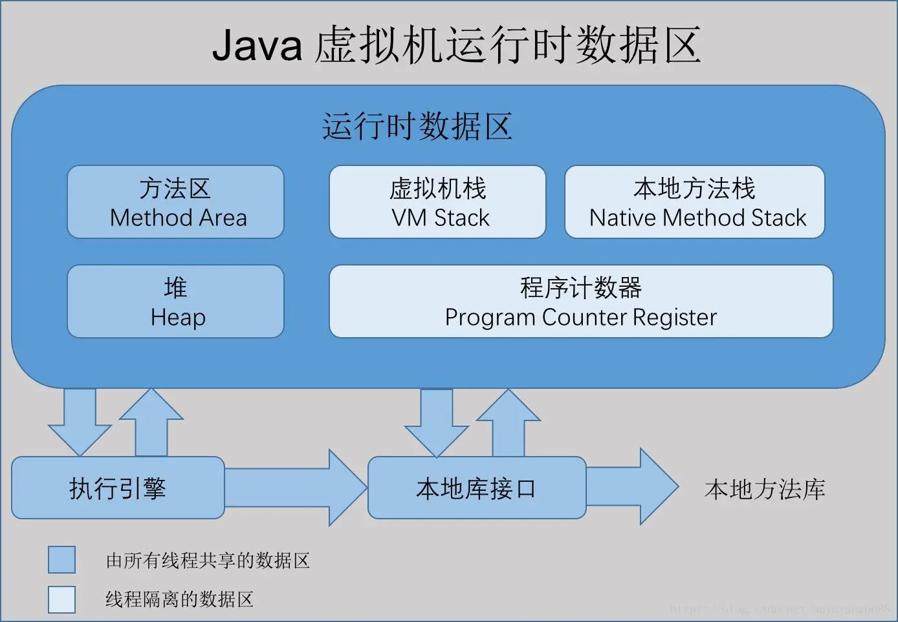

# JVM内存划分

[TOC]

## 介绍

根据Java虚拟机的规范，主要将内存划分为以下几个区域：程序计数器、虚拟机栈、本地方法栈、堆、方法区（JDK1.8之前才有，JDK1.8及之后的版本已经移除该区域，采用了元空间）、直接内存。其中，程序计数器、虚拟机栈、本地方法栈是线程私有的内存区域，堆和方法区（元空间）是所有线程共用的内存区域。

## 程序计数器

程序计数器是JVM内存中较小的一块区域，可以把它看作是当前线程执行的字节码的行号指示器。代码分支、循环、跳转、异常处理、线程恢复等需要依赖它来实现。JVM的多线程是通过线程轮流切换并分配处理器的执行时间来实现的，在任一确定的时刻，一个处理器（内核）只会执行一个线程中的一条指令。

每个线程都有一个独立的程序计数器来记录当前线程执行的位置，各个线程之前互不影响，所以是线程私有的。若线程执行的是Java方法，程序计数器记录的就是正在执行的虚拟机字节码指令的地址；若线程执行的是Native方法，则程序计数器的值为空。程序计数器是唯一一个在JVM规范中没有OutOfMemoryError的区域。

## 虚拟机栈

虚拟机栈是线程私有的，和线程拥有相同的生命周期。每个方法在执行时都会创建一个栈帧来保存局部变量表、操作数栈、动态链接、方法出口等信息，每个方法从执行到完成都对应着一个栈帧在虚拟机栈中从入栈到出栈的过程。

局部变量表包含了编译器可知的各种基本数据类型、对象引用（可能是一个指向对象起始地址的指针引用，也可能是指向一个代表对象的句柄或其他与该对象关联的地址）、returnAddress类型（指向一条字节码指令的地址）。局部变量表所需的空间大小在编译器就已经完成了分配，方法运行期间不会改变。

虚拟机栈有两种异常情况：

1. 当线程所请求的栈深度超过了虚拟机所允许的最大栈深度，会抛出StackOverFlowError
2. 当虚拟机栈可动态扩展，但在扩展时无法申请到足够的内存，会抛出OutOfMemoryError

## 本地方法栈

虚拟机栈是为执行Java方法服务的，本地方法栈是为执行Native方法服务的。Sun HotSpot直接把虚拟机栈和本地方法栈合二为一了。

## 堆

堆是Java虚拟机所管理的较大的一块内存区域，被所有的线程共享，在虚拟机启动时创建。绝大多数的对象和数组都是在堆上分配内存的。

堆是垃圾收集器管理的主要区域，现在基本上都采用分代回收的方式。堆分为新生代和老年代，其中，新生代又是由Eden、survivor区构成的。从内存分配的角度看，线程共享的Java堆可能划分出多个线程私有的分配缓冲区。

堆可处于物理上不连续的内存空间中，只要逻辑上是连续的即可。在实现上，堆的大小可以固定也可以动态扩展，可通过-Xmx和-Xms的参数进行控制。若在堆中没有内存供实例分配且堆也无法进行扩展时，将会抛出OutOfMemoryError。

## 方法区

方法区是各个线程共享的一块内存区域，用于存储已经被JVM加载的类信息、常量、静态变量、即时编译器编译之后的代码等信息。JVM规范把它描述为堆的一个逻辑部分。

在JDK1.7及其之前，很多人把方法区叫做“非堆”，也有很多人把它叫做永久代，因为JVM采用了永久代来实现方法区，GC收集器也扩展到了方法区。

方法区不需要连续内存，可选固定大小、也可扩展，还能选择不实现垃圾回收。因为相对而言，该区域发生GC的行为较少且垃圾回收成本大。该区域主要是针对常量池的回收和对Class的卸载。 

当方法区无法满足内存分配需求时，将会抛出OutOfMemoryError。

在JDK1.7版本的Sun HotSpot实现中，已经将原本放在方法区中的静态变量、字符串常量池转移到了堆上，在JDK1.8中，则是移除了方法区，原方法区中存储的类信息、即时编译器编译后的代码数据等信息已经移动到了元空间（Metadata）中，元空间并没有占用堆内存，而是直接只用本地内存。

## 元空间 

在JDK1.8中，元空间（Metadata）已经取代了方法区，元空间并不在Java虚拟机中，而是直接使用本地内存，元空间的大小仅受本机内存限制，可以通过-XX:MetaspaceSize和-XX:MaxMetaspaceSize这两个参数来指定元空间的大小。

## 运行时常量池

运行时常量池是方法区中的一部分，Class文件中除了有类的版本、字段、方法、接口描述等信息之外，还有一个常量池，用于存放编译期生成的各种字面量和符号引用，这部分内容将在类加载后存在到方法区的运行时常量池中。

常量并非一定只能在编译器产生，例如调用String.intern() 方法可以在运行期间产生字符串常量。运行时常量池的大小会受到方法区的内存限制，当常量池无法申请到足够的内存时将会抛出OutOfMemoryError。

## 直接内存

直接内存不是虚拟机运行时数据区的一部分，也不是JVM规范中定义的内存区域，但它也可能会导致OutOfMemoryError。直接内存不受JVM堆大小的限制，但会受到本地总内存（RAM以及SWAP分区或分页大小）以及处理器寻址空间的限制。

当各个内存区域总和大于本机物理内存限制时，动态扩展就会出现OutOfMemoryError。

## 参考文献

深入理解Java虚拟机