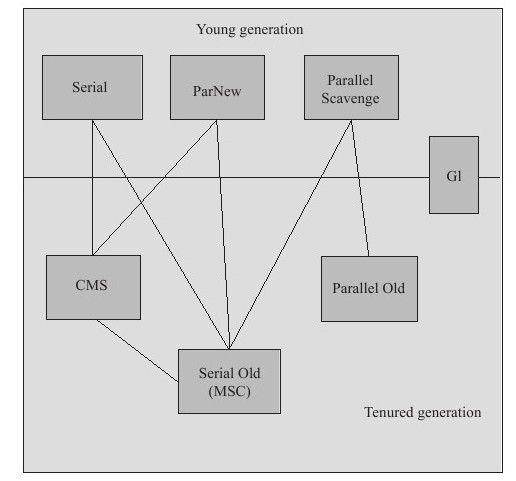

# JVM垃圾回收以及内存分配策略

[TOC]

## 计算对象存活的算法

### 引用计数算法（Reference Counting）

给对象添加一个引用计数器，每有一个地方引用则加一，引用失效时则减一；任意时刻计数器的值变为0时则认为对象就是不会被使用的。

该算法简单高效，但它很难解决对象之间互相引用的问题。

### 根搜索算法（GC Rooting Tracing）

通过名为“GC Roots”的对象作为起始点，从这些点开始向下搜索，经过的路径称为引用链，当一个对象到GC Roots对象没有任何引用链时，则认为这些对象是不可达的，说明这些对象不可用。

在Java语言中，可作为GC Roots的对象有以下几种：

1. 虚拟机栈（栈帧的本地变量表）中的引用指向的对象
2. 方法区中的类静态属性引用的对象
3. 方法区中的常量引用的对象
4. 本地方法栈中的JNI（Native方法）引用的对象

## 引用类型

Java中的引用类型分为强引用、软引用、弱引用和虚引用。

### 强引用（Strong Reference）

只要强引用存在，GC就永远不会回收被引用的对象。

### 软引用（Soft Reference）

描述有用但并非必须的引用。当系统要发生内存溢出前会将这些引用的对象进行二次回收，如还没有足够的内存空间则抛出OutOfMemoryError。

### 弱引用（Weak Reference）

被弱引用关联的对象只能存活到下一次GC之前。

### 虚引用（Phanton Reference）

虚引用又被称为幽灵引用或叫做幻影引用，无法通过虚引用获取到对象实例，它的作用仅仅是在对象被回收时受到一个系统通知。


## 对象的死亡与逃生

一个Java对象的死亡要经过两次标记。

1. 第一次标记

在进行根搜索后发现没有与GC Roots关联的引用链，将被进行第一次标记并筛选，条件是该对象是否有必要执行finalize方法，若对象未覆写finalize方法或finalize方法已被JVM调用过，则被视为没必要执行。

若对象被视为有必要执行finalize方法，该对象会被一个名为“F-Queue”的队列中，并在稍后由虚拟机自动创建低优先级的Finalizer线程去执行。

finalize方法是对象逃生的最后一次机会。

2. 第二次标记

GC线程会对F-Queue队列中的对象进行第二次小规模标记。该队列中的对象只要重新与引用链上的任何对象关联上，比如把自己（this指针）复制给某个存活类的变量或对象的成员变量，那么在第二次标记时就会从“即将回收”的集合中移除，也就会在finalize方法中拯救自己。


## 永久代（方法区）的垃圾回收

永久代的GC主要包括对废弃常量的回收和无用的类的卸载。与回收堆中的对象类似，同时满足以下三个条件时才会被视为无用的类：

1. 该类的所有实例已经被回收，也就是说堆中已经没有该类的任何实例
2. 加载该类的类加载器已经被回收
3. 该类的```java.lang.class```未被任何地方引用，也无法在任何地方通过反射访问该类的方法


## 安全点与安全区域

### 枚举根节点

从GC Roots寻找引用链的过程必须停顿所有的Java执行线程，因为可达性分析的过程必须在一个能完全确定的快照版本中完成，如果在分析过程中对象的引用关系还在发生变化，那么分析结果的准确性就无法保证。当系统停顿下来之后，虚拟机并不需要检查所有的执行上下文和全局的对象引用，他有办法直到哪些地方存放着对象引用。

在Sun HotSopt虚拟机的实现中，它采用了一组称为OopMap的数据结构来实现，在类加载完毕时，会把对象内什么偏移量上的对象类型数据计算出来，在JIT的编译过程中也会在栈和寄存器中记录下哪些位置是对象引用。这样，虚拟机就不需要扫描整个内存区域就知道所有对象的引用。

### 安全点（Safe Point）

在OopMap的协助下，HotSpot可以快速完成根节点枚举，但是导致对象引用关系变化（或者说OopMap内容变化）的指令非常多，如果为每一条指令都生成对应的OopMap，则会需要非常多的空间，这样GC成本就会很高。

实际上，HotSpot并不是为每一条指令都生成了OopMap，而只是在特定的位置记录了对象引用的信息，这些位置就叫做**安全点**，只有当应用程序跑到安全点时，才会进行GC的过程。具有“长时间执行”特征的指令序列才会产生安全点，例如：方法调用、循环跳转、异常跳转等。

在用户线程跑到安全点之后停顿下来进行GC，有两种中断方式：抢占式中断和主动式中断。抢占式中断会直接中断所有线程，如果被中断的线程没有到达安全点，则恢复该线程，让它执行到下一个安全点；主动式中断会在中断时设置一个标记，执行线程会主动轮询这个标记，当发现中断标记为true时则自己中断挂起。

### 安全区域（Safe Region）

当应用程序没有分配CPU的执行时间，比如线程处于Sleep状态或者Blocked状态时，虚拟机不可能等到线程被重新分配CPU执行时间然后走到安全点之后将自己中断挂起。此时，就需要**安全区域**来解决这个问题。

**安全区域**就是指在一个代码片段内，对象的引用关系不会发生任何变化，在这个区域内GC就是安全的。可以把安全区域看作是扩展了的安全点。

当线程执行到了安全区域时，会标记自己进入了安全区域，在这段时间内发生的GC就不需要管那些已经标记自己进入了安全区域的线程；当线程在离开安全区域时，会检查是否完成了根节点枚举或GC，如果完成了则可以继续执行，否则需要等待直到收到可以离开安全的信号为止。


## 垃圾回收算法

常见的垃圾回收算法有标记-清除、复制、标记-整理等。

### 标记-清除（Mark-Sweep）

标记-清除算法的策略是先标记所有要回收的对象，然后统一回收所有被标记的对象。这种算法效率较低且会产生空间碎片。

### 复制（Copy）

复制算法会将可用内存划分为大小相等的两个区域，一块用完，就将或者的对象复制到另外一块区域中，然后把第一块区域中的内存全部释放。该算法的代价是会把实际可用内存缩小为原来的一半。

Sun Hot Spot虚拟机的默认实现是Eden:Survivor = 8:1，这样只有10%的空间浪费。但是，当Survivor空间不足时，要依赖其它内存（老年代）进行空间分配担保。

### 标记-整理（Mark-Compact）

标记-整理算法是先标记出所有存活的对象，然后将存活的对象向一端移动，最后直接清理掉存活对象边界以外的空间。

### 分代收集（Generational Collection）

分代收集算法是根据对象的存活周期将内存划分为几个区域：新生代、老年代。新生代的小对象多且大多数都是朝生夕死，因此采用复制算法；老年代的对象大多都比较大且生命周期比较长，采用标记-清除或标记-整理算法。

## 垃圾收集器



### Serial

采用复制的算法，是一个单线程垃圾收集器，在运行时会“stop the world”。对于单CPU环境来说，由于没有线程上下文切换的开销能够获得最高的效率，适用于新生代Client模式下的虚拟机。

### ParNew

采用复制的算法，是Serial收集器的多线程版本，适用于新生代的Server模式。

### Parallel Scavenge

是一个吞吐量优先的多线程并行垃圾收集器，目标是达到一个可控的吞吐量，提交CPU的利用率。适用于新生代，在后台运算而不需要太多交互的任务。

### Serial Old

采用标记-整理的算法，是一个单线程的垃圾收集器，它是Serial收集器的老年代版本，适用于老年代Client模式下的虚拟机。

### Parallel Old

采用标记-整理的算法，是一个多线程的垃圾收集器，它是Parallel Scavenge的老年代版本，适用于注重吞吐量以及对CPU资源敏感的场景。

### CMS（Concurrent Mark Sweep）

采用标记-清除的算法，是一种以获取最短回收停顿时间为目标的垃圾收集器。适用于注重服务的响应速度，希望系统停顿时间最短，给用户带来更好的体验等场景下（如web程序、b/s服务等）。

CMS垃圾收集器包含以下4个阶段：

1. 初始标记

   初始标记标记GC Roots能关联到的对象。这一阶段速度很快但会“stop the world”

2. 并发标记

   并发标记进行GC Roots Tracing，找出存活的对象。这一阶段用户线程仍可执行

3. 重新标记

   重新标记修正并发标记期间用户程序继续执行而导致标记产生变动的那部分对象的标记记录。这一阶段速度也很快但也会“stop the world”

4. 并发清除

   并发清除阶段会对标记的对象进行清除。

CMS收集器的特点如下：

- 对CPU资源敏感

  默认会开启（CPU数量+3）/4个回收线程，也就是说垃圾回收至少要占用25%的CPU资源。当CPU数量较小时，由于要分出相当一部分运算能力去执行垃圾回收，就可能导致应用程序的速度降低很多。	

- 无法处理浮动垃圾，可能会出现Concurrent Mode Failure而导致另一次Full GC

  由于并发清除是垃圾清理线程与用户线程并行执行的，无法处理用户线程执行时产生的新的垃圾。CMS收集器需要给用户线程预留足够的空间，而不能等老年代满了再进行GC，当老年代的空间占比超过一定的阈值时就会触发FC，可以通过参数```-XX:CMSInitiatingOccupancyFraction```来调整这个百分比。当CMS收集器给用户线程预留的空间不足时，就会出现"Concurrent Mode Failure"。

- GC结束后会产生大量空间碎片，导致大对象无法分配空间而不得不提前出发一次Full GC

  由于CMS收集器采用的是标记-清除的算法，会产生大量的空间碎片。为解决这个问题，CMS收集器提供了一个开关参数```-XX:+UseCMSCompactAtFullCollection```（默认开启），用于在进行垃圾回收之后进行一次内存碎片的合并整理；但是该过程无法与用户线程并行执行，会导致停顿时间变长。虚拟机的设计者还提供了另外一个参数```-XX:CMSFullGCsBeforeCompaction```用来控制CMS收集器在进行多少次GC之后进行一次空间碎片的在整理合并。

### G1（Garbage First）

采用标记-整理的算法，没有空间碎片，可精确控制回收停顿，实现在基本不牺牲吞吐量的前提下完成地停顿的垃圾回收。G1收集器能避免Full GC，它把整个Java Heap（包含新生代、老年代）划分为多个固定大小的独立区域，并跟踪他们的垃圾堆积程度，在后台维护一个优先级列表，每次会根据允许的垃圾收集时间优先回收垃圾最多的区域。区域划分以及有优先级的区域回收策略，保证了G1收集器在有限时间内获取最高的效率。

G1收集器的工作过程大致分为以下几步：

1. 初始标记

   标记出GC Roots能关联到的对象，保证下一阶段用户程序并发运行时，能够在正确可用的Region中创建新对象。这一阶段会“stop the world”，但停顿时间很短

2. 并发标记

   对对象进行可达性分析找出存活对象。这一阶段耗时较长但可以和用户线程并行执行

3. 最终标记

   修正在并发标记期间由于用户程序继续执行导致标记发生的变化的那部分记录。对象的变化会记录在Remembered Set Logs中，会把Remembered Set Logs里边的数据合并到Remembered Set中。这一阶段会“stop the world”，但可以和用户线程并行执行

4. 筛选回收

   对各个Region的回收价值和回收成本进行排序，根据用户锁期望的GC停顿时间来制定回收计划。在空间回收时可以和用户线程并发执行。

### 相关知识补充

- 并行收集

  开启多个垃圾收集线程并行工作，此时用户线程仍在等待，称之为“stop the world”。

- 并发收集

  垃圾收集线程和用户线程同时执行（不一定是并行工作，也可能是交替执行）。用户线程无需等待垃圾收集线程执行完毕，所以不会出现“stop the world”。

- 吞吐量

  CPU处于用户执行的时间占CPU消耗总时间的占比。对于JVM来说，吞吐量=执行用户代码的时间/(执行用户代码的时间+执行垃圾收集的时间)。


## 内存分配与回收策略

1. 对象优先在Eden区分配内存

   对象默认会在Eden区分配内存，当Eden区没有足够的空间进行分配时，将触发一次Minor GC：将Eden区、from survivor区的对象复制到to survivor区，清空Eden区和from survivor区的空间，并且此时from survivor区与to survivor区的空间角色互换。

2. 大对象直接进入老年代

   大对象可以直接在老年代中进行内存分配，避免产生不必要的GC。通过```-XX:PertenureSizeThreshold```参数可以指定直接进入老年代的对象大小的阈值。

3. 长期存活的对象将进入老年代

   虚拟机为每个对象定义了一个的对象年龄计数器，当对象的年龄增长（每在Survivor区中熬过一轮Minor GC则加一）到一定程度（默认为15）是，则会从新生代晋升到老年代中。通过```-XX:MaxTenuringThreshold```参数可以指定晋升到老年代的对象年龄。

4. 动态年龄判断

   如果Survivor区中相同年龄的对象总大小超过了Survivor区空间的一半，那么年龄大于等于该年龄的对象则可以直接晋升到老年代中，而不需要达到```-XX:MaxTenuringThreshold```参数指定的大小。

5. 空间分配担保

   在Minor GC发生之前，虚拟机会检查老年代的最大可用连续空间是否大于新生代所有对象的总和，如果大于则说明本次GC是安全的。否则，虚拟机会查看HandlePromotionFailure设置的值是否允许担保失败，如果允许，虚拟机会继续检查老年代的最大可用连续空间是否大于之前历次晋升到老年代对象的平均大小，如果大于，则进行一次Minor GC；如果小于或者HandlePromotionFailure设置的值不允许担保失败，则进行一次Full GC。


## 参考文献

深入理解Java虚拟机
