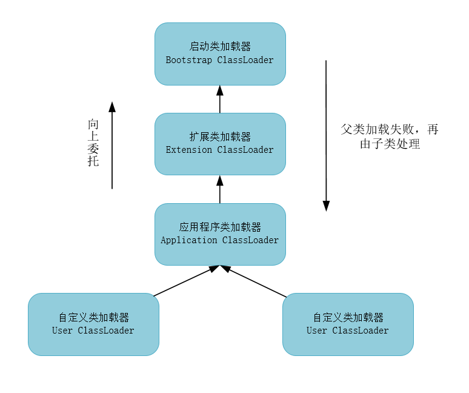

# JVM类加载机制

[TOC]

## 类加载的时机

类从被加载到虚拟机内存开始，到卸载出内存为止，它的生命周期要经过加载、验证、准备、解析、初始化、使用、卸载这些阶段。其中，验证、准备、解析这三个阶段统称为连接。

虚拟机规范规定有且仅有五种情况必须要对类进行初始化：

1. 遇到new、getstatic、putstatic、invokestatic这4条字节码指令时，若类还未初始化则需要先触发该类的初始化。这四条指令分别对应的场景为：使用new实例化对象、读取或设置类的静态非final字段、调用一个类的静态方法。
2. 使用```java.lang.reflect```包下的方法对类进行反射调用。
3. 初始化一个类时，若父类未初始化则需要先触发父类的初始化。
4. 虚拟机启动时需要先初始化用户执行的主类，即包含main方法的类。
5. 当使用jdk1.7的动态语言支持时，若一个```java.lang.invoke.MethodHandle```实例最后的解析结果是REF_getStatic、REF_putStatic、REF_invokeStatic的方法句柄，且该方法句柄所对应的类没有初始化，则需要先触发其初始化。

以上的5种场景成为对一个类进行主动引用。除此之外，所有引用类的方式都不会触发类的初始化，称之为被动引用。例如：

- 子类引用父类的静态非final字段，只会触发父类的初始化而不会初始化子类
- 通用数组定义引用类不会触发该类的初始化
- 引用静态常量不会触发该类的初始化，在编译期会将此常量存储到NotInitialization类的常量池中，对该常量的引用都被转化为对NotInitialization类对自身常量池的引用

当一个类初始化时要求其父类全部都已经完成了初始化，但接口在初始化时并不要求其父接口全部完成初始化，只有真正用到父接口（如引用父接口中定义的常量）时才会初始化。


## 加载

类加载主要包含三步：

1. 通过一个类的全限定名获取定义此类的二进制字节流
2. 将二进制字节流所代表的静态存储结构转化为方法区的运行时数据结构
3. 在Java堆中生成一个代表该类的```java.lang.Class```对象，作为方法区这个类的这些数据的访问入口


## 验证

验证是连接阶段的第一步，其目的是为了确保Class文件的字节流中包含的信息符合当前虚拟机的要求且不会危害虚拟机的自身安全。验证主要包含四步：

1. 文件格式验证

   直接操作字节流，确保输入的字节流能够正确解析并存储在方法区之类，格式上要符合描述一个Java类型信息的要求。

2. 元数据验证

   进行语义分析，保证其描述的信息符合Java语言规范。

3. 字节码验证

   通过数据流、控制流的分析，确定程序语义是合法的、符合逻辑的。该阶段对类的方法体进行校验分析，确保方法在运行时不会危害虚拟机的安全。

4. 符号引用验证

   发生在虚拟机将符号引用转化为符号引用的时候（解析阶段），确保解析动作能够正常执行。


## 准备

准备阶段正式为类变量（被static修饰的变量）分配内存并设置初始值，这些内存将在方法区中完成分配。除ConstantValue属性（被public static final修饰）的类变量除外，初始值赋为零值。


## 解析

解析阶段是虚拟机将常量池类的符号引用转化为直接引用的过程。包括以下解析：

1. 类或接口的解析
2. 字段解析
3. 类方法解析
4. 接口方法解析


## 初始化

初始化是执行类构造器```<cinit>()```方法的过程，初始化阶段才真正开始执行类中定义的Java代码（字节码）。类的初始化要遵循以下规则：

1. 编译器收集的顺序由语句在源文件中出现的顺序决定，静态语句块中只能访问到定义在静态语句块之前定义的变量，定义在它之后的变量在之前的静态语句块中可以赋值但不能访问
2. 虚拟机会保证子类的```<cinit>()```方法在执行前父类的```<cinit>()```方法一定会执行完成，因此在虚拟机中第一个被执行```<cinit>()```方法的类一定是```java.lang.Object```

3. 父类中定义静态语句块优先于子类的变量赋值操作
4. ```<cinit>()```方法对于类或接口来说不是必须的，若一个类中无静态语句块和变量赋值操作，那么编译器可以不为该类生成```<cinit>()```方法
5. 接口没有静态语句块，但是有变量初始化的赋值操作，也会为接口生成```<cinit>()```方法。但与类不同的是，接口执行```<cinit>()```方法时不需要先执行父接口的```<cinit>()```方法；只有当父接口中的变量被使用时，父接口才会初始化；接口的实现类在初始化时也不会执行接口的```<cinit>()```方法
6. 虚拟机会保证一个类的```<cinit>()```方法在多线程环境下被正确加锁和同步


## 类加载器

对任一个类来说，由加载它的类加载器和该类本身共同确立它在JVM中的唯一性，只有两个类是由同一个类加载器加载时，比较才由意义。类加载器分为三种：

1. 启动类加载器

   负责加载```<JAVA-HOME>/lib```目录下或是被```-X bootclasspath```参数指定的路径且是虚拟机识别的（仅按文件名识别，如rt.jar）类库。启动类加载器无法被Java程序直接使用。

2. 扩展类加载器

   负责加载```<JAVA_HOME>/lib/ext```目录下或是被系统变量```java.ext.dirs```指定的路径下的所有类库。开发者可以直接使用扩展类加载器。

3. 应用程序类加载器

   这个类加载器由```sun.misc.launcher$AppClassLoader```来实现，它是```ClassLoader```类中```getSystemClassLoader```方法的返回值，也被称为系统类加载器。它负责加载用户路径（即classpath）上指定的类库，这是程序中默认的类加载器。


### 双亲委派模型



在这种双亲委派模型中，父子关系不会以继承的方式实现，而是使用组合关系来复用父类加载器的代码。其工作过程是：若一个类加载器收到了类加载的请求，它首先不会自己尝试去加载，而是把请求委派给父类，每个层次都是如此。因此所有的类加载请求最终都应当传到最顶层的启动类加载器中，只有父类加载器反馈自己无法完成加载时，子类加载器才会尝试自己去加载。

实现双亲委派模型的代码集中在ClassLoader的loadClass()方法中：先检查该类是否被加载过，若未被加载则调用父加载器的loadClass()方法进行加载；若父加载器为空则默认使用启动类加载器作为父加载器。若父加载器加载失败，则抛出ClassNotFoundException后再调用自己的findClass()方法进行加载。

```java
protected synchronized Class<?> loadClass(String name, boolean resolve) 
    throws ClassNotFoundException {
	Class c = findLoadedClass(name);
    if (c == null) {
        try {
            if (parent != null) {
                c = parent.loadClass(name, false);
            } else {
                c = findBootstrapClassOrNull(name);
            } 
        } catch (ClassNotFoundException e) {
            
        }
        if (c == null) {
            c = findClass(name);
        }
    }
    if (resolve) {
        resolveClass(c);
    }
    return c;
} 
```

双亲委派模型很好地解决了各个类加载器的基础类的统一问题，越基础的类由越上层的加载器进行加载。


## 参考文献

深入理解Java虚拟机