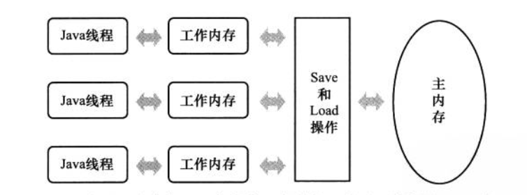
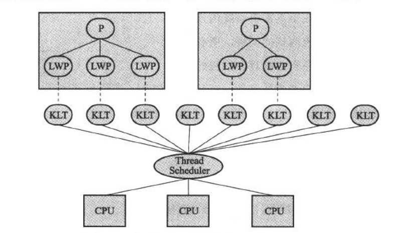
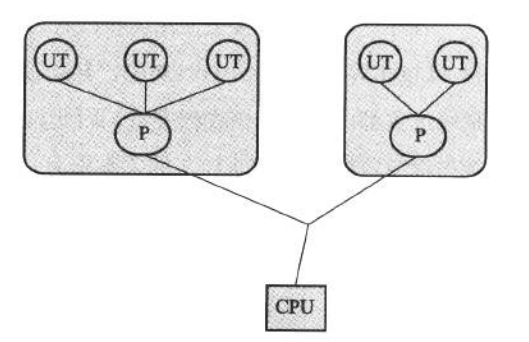
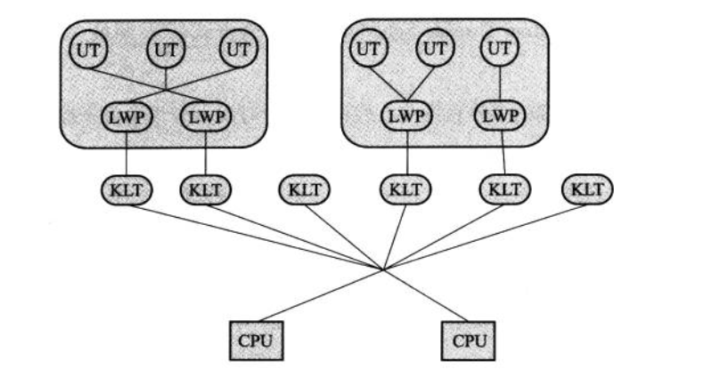
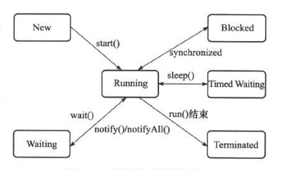

# Java内存模型与线程

[TOC]

## Java内存模型

Java内存模型规定所有的变量都存储在主内存中，每个线程都有自己的工作内存，线程的工作内存中保存了它所用到的变量在主内存中的变量副本。线程对变量的所有读写操作都是在工作内存中完成，不能直接读写主内存中的变量。不同线程之间不能直接访问对方线程工作内存中的变量，它们之间的交互都要通过主内存来完成。Java线程、主内存、工作内存之间的关系如下图：

### 内存间交互的8大基本原子操作

1. lock（锁定）：作用于主内存的变量，将变量标识为线程独占的状态
2. unlock（解锁）：作用于主内存的变量，将变量从线程独占的状态释放
3. read（读取）：作用于主内存的变量，将变量从主内存传输到工作内存，以供load
4. load（载入）：作用于工作内存的变量，将read从主内存读取的变量放到工作内存的变量副本中
5. use（使用）：作用于工作内存的变量，将工作内存的变量传给执行引擎，当虚拟机遇到一个需要使用该变量的字节码指令时执行
6. assign（赋值）：作用于工作内存的变量，将从执行引擎收集回来的值赋给工作内存的变量，当虚拟机遇到为该变量赋值的字节码指令时执行
7. store（存储）：作用于工作内存的变量，将工作内存中的变量传输到主内存，以供write
8. write（写入）：作用于主内存的变量，将从工作内存获取的变量放到主内存的变量中

如果要把一个变量从主内存复制到工作内存，就要依次执行read、load操作；若要把一个变量从工作内存同步回主内存，就要依次执行store、write操作。

这8大基本操作需要满足以下规则

- 不允许read和load、store和write操作单独出现
- 不允许一个线程丢弃它最近的assign操作
- 不允许一个线程无原因的（无assign操作）把一个变量从工作内存同步到主内存
- 一个新的变量只能在主内存中初始化，在对一个变量进行use、store之前必须先执行过了assign和load操作
- 一个变量同一时刻只允许一个线程对其进行lock操作，但lock操作可以被一个线程执行多次，在多次lock之后，只有执行相同次数的unlock，变量才能被解锁
- 如果对一个变量执行lock，会清空工作内存中该变量的值，在执行引擎使用前，需要重新执行load或assign操作初始化变量的值
- 对一个变量未执行lock之前，不允许执行unlock操作，也不能对被其他线程锁定的变量执行unlock操作
- 对一个变量执行unlock之前，需要把该变量同步回主内存，即执行store、write操作

### volatile型变量特殊规则

volatile是Java虚拟机提供的最轻量级同步机制，volatile型变量的运算在并发环境下并不是线程安全的。volatile的作用有两个：

1. 保证变量对所有线程可见，当volatile型变量的值发生改变时，其它线程可以立即得知
2. 禁止指令重排序优化

针对volatile型变量，遵循以下规则：

- load、use操作必须连续出现，即每次在工作内存中使用变量时，都要从主内存中读取最新的值，用于保证能看见其它线程对变量做了修改之后的值
- assign、store操作必须连续操作，即每次对变量修改之后都要把变量同步到主内存，用于保证其它线程能够看见自己对变量的修改
- 代码的执行顺序要和程序的顺序相同

### 原子性、可见性、有序性

- 原子性

  原子性变量操作有read、load、use、assign、use、store、write，对基本数据类型的读写以及synchronized关键字。

- 可见性

  可见性是指当一个线程修改共享变量时，这个修改能够被其它线程立即得知。除了volatile之外，synchronized和final这两个关键字也能实现可见性；synchronized是通过对一个变量执行unlock之前，必须要先把它同步回主内存来实现的；final关键字是因为被final修饰的字段在构造其中一旦完成初始化且没有发生
  "this逃逸"，那么该字段对其它线程就是可见的，它们无需同步就能被其它线程正确访问。

- 有序性

  有序性是指所有的操作在线程内表现为串行，在线程外则会指令重排序；工作内存与主内存会存在同步延迟现象。volatile和synchronized关键字可以保证有序性。

### 先行发生原则（Happens-Before）

以下先行发生原则是Java语言中不需要任何同步手段就能保障的：

- 程序次序规则

  在一个线程内，按照控制流顺序，前面的操作比后边的操作先发生。

- 管程锁定规则

  一个unlock操作先行发生于后面对同一个锁的lock操作。

- volatile变量规则

  对一个volatile变量的写操作先行发生于对同一个变量的读操作。

- 线程启动/终止规则

  Thread对象的start方法先行发生于此对象后边的所有操作；线程中的所有操作先行发生于对该线程的终止检测。

- 线程中断规则

  对线程interrupt方法的调用先行发生于被中断线程检测到线程中断的发生。

- 对象终结规则

  一个对象的初始化先行发生于它的finalize方法的调用

- 传递性规则

  如果操作A先于B，操作B先于Ｃ，那么操作Ａ先于Ｃ。

## Java线程

进程是资源调度的最小单位，线程是CPU调度（程序执行）的最小单位，是比进程更轻量级的调度执行单位。

### 线程的实现

1. 使用内核线程实现

   内核线程（KLT）是直接由操作系统支持的线程，这种线程由内核来完成线程切换。内核通过操作调度器来对线程进行调度，并负责将线程的任务映射到处理器上。程序一般不会直接使用内核线程，而是通过一种内核线程的高级接口轻量级进程（LWP），即我们通常意义上讲的线程。每个轻量级进程都需要一个内核线程支持，这种轻量级进程与内核线程1:1的模型如下图：

   

   这种方式由操作系统直接支持，每个线程都是一个可以独立调度的单元，各个线程之间互不影响，但是系统调用的代价比较高，需要在用户态和内核态之间来回切换；其次，每个轻量级进程都需要一个内核线程支持，需要消耗一定的内核资源（如内核线程栈空间等），所以轻量级进程的数量有限。

   

2. 使用用户线程实现

   用户线程（UT）广义上指的是非内核线程，狭义上指完全建立在用户空间的线程。用户线程的建立、同步、销毁和调度完全在用户态中完成，不需要内核的帮助。这种线程不需要切换到内核态，操作非常快且消耗低；采用进程和用户线程1:N的方式，也能支持规模更大的线程数量。

​		使用用户线程的优势在于无需系统内核的支持，缺点也在于没有系统内核的支持，线程的创建、销毁、调		度都需要用户程序自行处理，程序实现复杂。

3. 使用用户线程加轻量级进程的实现

   用户线程和轻量级进程的混合实现，既存在用户线程，又存在轻量级进程。用户线程完全建立在用户空间中，用户线程的创建、切换、析构等操作依然消耗很少，且能支持大规模的用户并发。操作系统支持的轻量级进程作为用户线程和内核线程的桥梁，这样可以利用内核提供的线程调度功能和处理器映射的优势，同时降低了整个进程被阻塞的风险。这种模式中，用户线程和轻量级进程的数量比并不是固定的，是N:M的关系。

4. Java线程的实现

   Java线程是基于操作系统的线程模型实现的，对程序运行时透明的。

   Sun Jdk的windows和linux版本，都采用了1:1的线程模型，即一个用户线程映射到一个轻量级进程。

### 线程的调度

线程调度是指操作系统为线程分配处理器的使用权的过程，主要的调度方式有以下两种

- 协同式线程调度

  线程的执行时间由线程自己来控制，线程把自己的工作做完之后，主动通知系统切换到另外一个线程上，这种方式实现简单，切换操作对自己可知，没有线程同步问题；缺点就是线程执行时间不可控，如果线程代码编写有问题，可能会导致整个进程一直阻塞。

- 抢占式线程调度

  系统为每个线程分配执行时间，线程的切换由系统来执行。这种方式的好处是线程执行时间可控，且不会出现某个线程导致整个进程阻塞的问题，还能设置线程优先级。

### 线程状态切换

Java语言中定义了5种线程状态，在任一时刻，一个线程只能处于其中一种状态。

1. 新建（New）

   创建后尚未启动的状态。

2. 运行（Running）

   包括操作系统中的Running和Ready，也就是可能正在执行或在等待CPU为它分配执行时间。

3. 等待（Waiting）

   分为无限等待和有限等待。系统不会为等待状态的线程分配CPU执行时间，无限等待的线程需要被其它线程显式唤醒，有限等待的线程无需其它线程而会在一定时间之后由系统自动唤醒。使线程进入无限等待状态的操作有：没有设置timeout参数的Object.wait()方法、没有设置timeout参数的Thread.join()方法和LockSupport.park()方法；使线程进入有限等待状态的操作有：Thread.slpeep()方法、设置了timeout参数的Object.wait()方法、设置了timeout参数的Thread.join()方法、LockSupport.parkNanos()方法和LockSupport.parkUntil()方法。

4. 阻塞（Bolcked）

   处于阻塞状态的线程在等待着获取一个排他锁，在程序等待进入同步区域时，线程将进入这种状态。

5. 结束（Terminated）

   线程已结束执行，就是结束状态。

线程状态转换关系如下图

## 参考文献

深入理解Java虚拟机