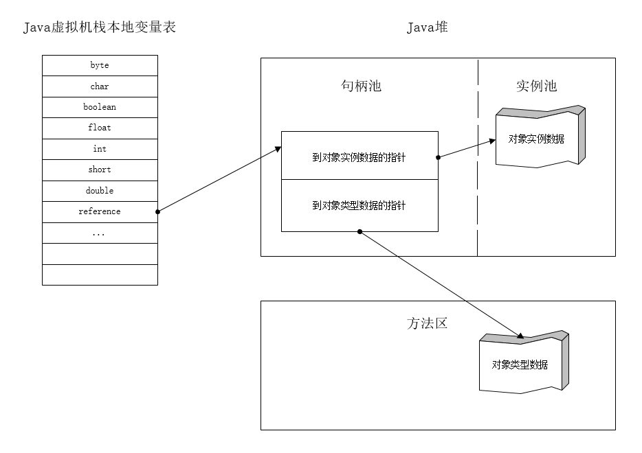
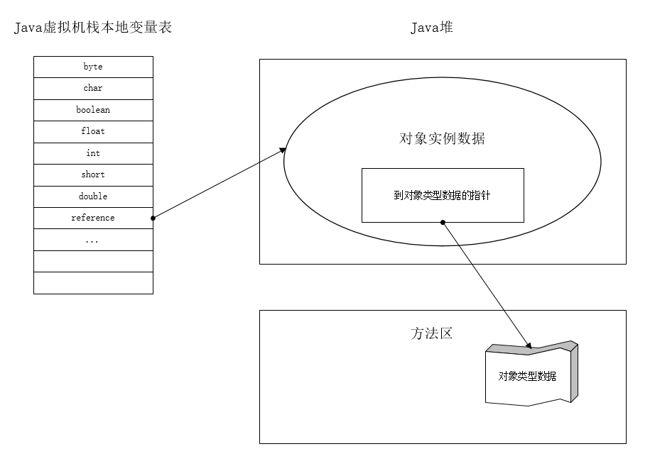

# Java对象的访问方式

[TOC]

Java对象的访问涉及到了堆、栈、方法区。

` Object obj = new Object`

左边的obj是一个局部变量，Object是一个引用（reference）类型数据，它们存储在虚拟机栈的本地变量表中；右边的对象实例在堆上分配内存，会在堆中开辟一块空间来存储Object类型的所有实例数据，其长度可变。堆中包含了能查到此对象类型数据（包括对象类型、父类、实现的接口、方法等）的地址信息，而这些类型数据则是存储在方法区中。

不同的JVM实现对象访问的方式不同，主流的访问方式有以下两种。

## 使用句柄的访问方式

这种方式的好处是reference中存储的是稳定的句柄地址，对象被移动（GC）时只会改变句柄中的实例数据指针，而reference本身不需要修改。

## 使用指针的访问方式

这种方式的好处是节省了一次指针定位的时间开销，因此速度很快。

Sun HotSpot虚拟机使用的是基于指针的访问方式。

## 参考文献

深入理解Java虚拟机

