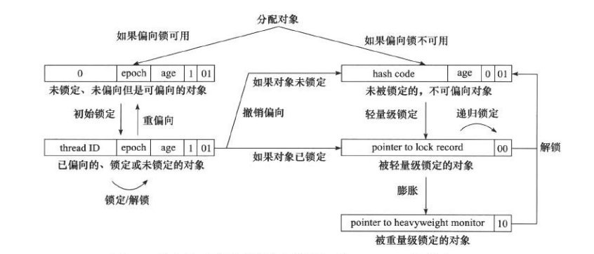

# 线程安全与锁优化

[TOC]

线程安全的定义：当多个线程访问一个对象时，如果不需要考虑这些线程在运行环境中的调度和交替执行，也不需要额外的同步措施，调用这个对象的行为就能获得正确的结果，那么这个对象就是线程安全的。

## Java中的线程安全

Java语言中各种操作共享的数据数据分为五类：

1. 不可变

   不可变对象一定是线程安全的，不需要采取任何的安全保障措施。例如被final关键字修饰的变量，其外部的可见状态永远不会改变。

2. 绝对线程安全

   无论在什么环境中运行，都不需要任何额外的同步措施，就能保证线程安全。

3. 相对线程安全

   相对线程安全是我们通常意义上讲的线程安全，它需要保证对这个对象单独的操作是线程安全的；但是对于一些特定顺序的调用，可能需要同步手段来保证调用的正确性。Java语言中的大部分线程安全类都属于这种类型，例如Vector、HashTable等。

4. 线程兼容

   线程兼容是指对象本身不是线程安全的，调用端需要采用正确的同步手段保证对象在并发环境下正确的执行。例如ArrayList、HashMap等。

5. 线程对立

   线程对立是指在多线程环境下，无论怎么采取同步措施都无法正确地让代码并发执行。例如Thread.suspend()方法和Thread.resume()方法。

## 线程安全的实现方法

### 互斥同步

同步是指在多线程并发访问共享数据时，保证共享数据在同一时刻只能被一个（或一些）线程使用。互斥的主要实现方式有临界区、信号量、互斥量等。

在Java语言中，最基本的互斥同步方法是使用synchronized关键字，synchronized关键字被编译之后会在同步块的前后分别生成monitorenter和monitorexit这两条字节码指令，这两个字节码指令都需要一个reference对象来指定要锁定的对象。如果指定了对象参数，那么锁定的就是这个对象；如果没有明确指定，则会根据synchronized修饰的是实例方法还是类方法，取对应的实例对象或者类方法所在的Class对象作为锁定对象。

另外一种互斥同步方式是使用ReentrantLock来实现，它比Synchronized关键字要高级，不仅支持可重入，还支持等待可中断、可实现公平锁以及锁绑定多个条件的功能。

在JDK1.6及之后的版本，Synchronized关键字的性能经过锁优化之后，已经能和ReentrantLock基本持平了。

互斥同步是悲观的并发策略，总是加锁。线程需要在用户态和核心态之间来回切换，并且要维护锁计数器、检查是否有被阻塞的线程需要被唤醒等操作，因此线程的阻塞和唤醒比较消耗性能。

### 非阻塞同步

非阻塞同步是采用基于冲突检测的乐观并发策略，先进行操作，若共享数据出现线程争用问题，则进行补偿措施（如不断重试直到成功为止）。我们需要操作并检测冲突这两个步骤具有原子性，这是靠硬件来保证的。

Java程序中可以使用CAS（Compare-And-Swap， 比较并交换），来避免阻塞同步。

CAS有三个操作数，分别是内存位置（V表示），旧的预期值（A表示），新值（B表示），CAS执行时，当且仅当V符合预期值A时，处理器用新值B更新V，否则不更新。无论是否更新了V的值，都返回V的旧值。CAS是一个原子操作。CAS有一个"ABA"的漏洞：当一个线程读取变量V的值是A，并在准备赋值的时候检查到它仍然是A，但是期间这个变量可能已经被其它线程先修改成了B、再修改为A，CAS操作就会误以为它没有被改变过。带有标记的原子引用类AtomicStampedReference解决了这个问题，它可以通过控制变量值的版本号来保证CAS操作的正确性。

### 无同步方案

如果一个方法本身就不涉及资源争用，那么它无需任何同步措施就是线程安全的。常见的有如下两类:

1. 可重入代码

   代码不依赖存储在堆上的数据和共用的资源，可在代码执行的任意时刻中断，转而执行另外一段代码，在控制权返回后原来的程序仍然可以正确的执行。

2. 线程本地存储

   把共享数据的可见范围限制在一个线程之内，这样无需同步就能保证线程之间不会出现数据争用问题。例如ThreadLocal。

## 锁优化

锁优化是为了在线程之间更高效地共享数据，以及解决竞争问题。

### 自旋锁与自适应自旋

自旋锁是让请求锁的线程执行一个忙循环（自旋），而不放弃处理器的执行时间，这样可以省去线程上下文切换的开销。但是如果锁被占用的是将很长，自旋的线程反而会白白浪费CPU资源。因此自旋等待时间必须要有一定的限度，如果超过了限定的次数仍然没有获得锁，就应当使用传统的方式挂起线程。

JDK1.6中引入了自适应的自旋锁，自旋的时间不再固定了，而是由前一次在同一个锁上的自旋时间以及锁的拥有者的状态来决定。如果在同一个锁对象上，自旋等待刚刚成功获得了锁且持有锁的线程在运行中，则认为这次自旋很有可能再次成功，进而允许进行相对更长时间的自旋；如果对于某个锁，自旋很少成功过，那么以后在获取这个锁时可以直接略过自旋的过程。

### 锁消除

所消除就是虚拟机的即时编译器运行时，对一些代码上要求同步但是被检测到不可能存在共享数据争用问题的锁进行消除。锁消除依赖于逃逸分析的支持，如果判定在一段代码中，堆上的所有数据都不会逃逸出去被其它线程访问到，就可以把它们当做栈上数据对待，锁自然也没必要再加了。

### 锁粗化

若一系列的连续操作都是对同一对象反复加锁和解锁，或者加锁出现在循环体中，频繁的互斥同步会导致不必要的性能消耗，这时虚拟机会把锁粗化为对整个方法加锁，即时方法内的大部分代码都没有线程争用。

### 轻量级锁

轻量级锁是在没有多线程竞争的前提下，减少传统的重量级锁使用操作系统互斥量所产生的性能消耗。但是如果存在锁竞争，那么除了互斥同步的开销外，还需要额外的CAS操作，因此在发生数据争用的情况下，轻量级锁会比传统的重量级锁更慢一些。

对象头的内存布局有两部分组成，一部分用于存储对象自身的运行时数据，例如哈希码（HashCode）、GC分代年龄等，称为"Mark Word"；另外一部分用于存储指向方法区对象类型数据的指针，如果是数组对象的话，还有一个额外的部分用于存储数据长度。"Mark Word"是实现轻量级锁、偏向锁的关键。

HotSpot虚拟机对象头"Mark Word"的标志位字段存储内容如下：

| 存储内容                             | 标志位 | 状态               |
| :----------------------------------- | :----: | :----------------- |
| 对象哈希码、对象分代年龄             |   01   | 未锁定             |
| 指向锁记录的指针                     |   00   | 轻量级锁定         |
| 指向重量级锁的指针                   |   10   | 膨胀（重量级锁定） |
| 空，不需要记录信息                   |   11   | GC标记             |
| 偏向线程Id、偏向时间戳、对象分代年龄 |   01   | 可偏向             |

**轻量级锁的执行过程**：

1. 在代码进入同步块时，如果同步对象还没有锁定（锁标志位为01），虚拟机首先会在当前线程的栈帧中建立一个叫做锁记录（Lock Record）的空间，用于存储所对象目前的Mark Word的拷贝（Displaced Mark Word）
2. 虚拟机使用CAS操作尝试将对象的Mark Word更新为指向锁记录的指针。如果更新成功，那么这个线程获取到了该对象的锁，对象Mark Word锁标志位将变为00，表示此对象处于轻量级锁定状态
3. 如果更新失败，虚拟机会检查对象的Mark Word是否指向当前线程的栈帧，如果是则说明当前线程已经获取到了该对象的锁，就可以直接进入同步块继续执行；否则说明这个锁对象已经被其它线程抢占了
4. 如果有两个以上的线程争用同一个锁，那么轻量级线程将不会再有效，要膨胀为重量级锁，锁标志位更新为10，Mark Word中存储的就是指向重量级锁的指针，后边等待锁的线程会进入阻塞状态 
5. 解锁过程也是通过CAS操作完成的，如果对象的Mark Word仍然指向着线程的锁记录，就使用CAS操作把对象当前的Mark Word和和线程中复制的Displaced Mark Word替换回来，如果替换成功，整个同步过程就完成了；如果替换失败，就说明有其它线程尝试获取过该锁，在释放锁的同时需要唤醒被挂起的线程

### 偏向锁

偏向锁是为了消除无竞争情况下的同步原语，进一步提高程序运行的性能。这个锁会偏向于第一个获得它的线程，若在接下来的执行过程中，该锁未被其它线程获取，则持有偏向锁的线程将永远不再需要进行同步。偏向锁并不一定是对程序运行有利的，如果程序中的大多数锁都是被多个不同的线程访问，那么偏向模式就是多余的，甚至禁止偏向锁优化能够提高性能。

**偏向锁的执行过程**：

1. 如果虚拟机开启了偏向锁，当锁对象第一次被线程获取的时候，虚拟机会把对象头中的标志位设置为01，即进入偏向模式，同时会使用CAS操作把获取到这个锁的线程Id记录到Mark Word中，如果CAS操作成功，持有偏向锁的线程以后再进入同一个锁的同步块的时候，就不需要任何的同步措施
2. 当另外一个线程去尝试获取这个锁时，偏向模式就会结束，会根据锁对象目前是否处于被锁定状态，撤销偏向后恢复到未锁定状态（锁标志位为01）或轻量级锁状态（锁标志位为00），后续的同步操作就会按照轻量级锁的执行过程进行

轻量级锁、偏向锁的转换关系如图：

## 参考文献

深入理解Java虚拟机