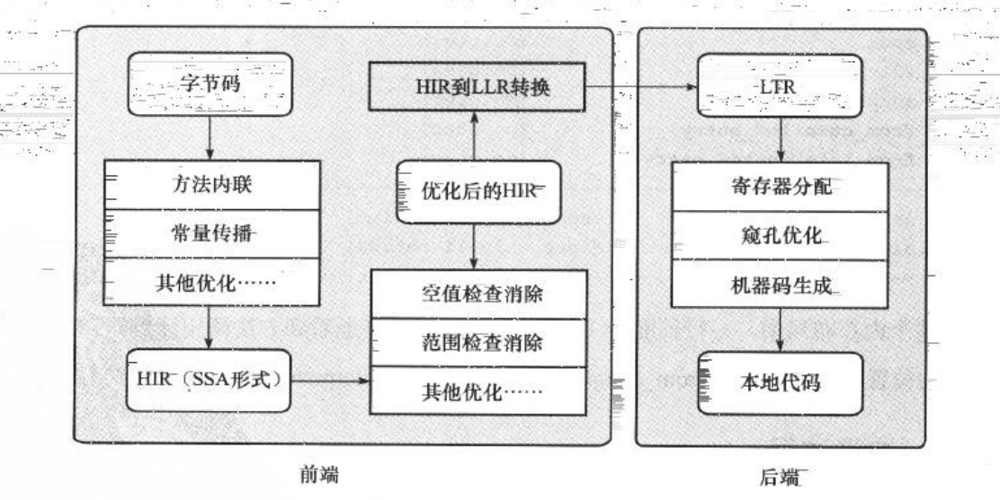

# 编译器优化和运行期优化

[TOC]

## 早期编译期优化

Javac编译器是前端编译器，它将Java文件编译为class文件。其编译过程分为以下三个阶段：

### 1. 解析与填充符号表

解析过程分为词法分析和语法分析，词法分析是将源代码的字符流转换为标记（Token）集合；语法分析是根据Token集合构建抽象语法树的过程。符号表是一组由符号地址和符号信息组成的表格，符号表中的信息在编译的不用时期都要用到。在语义分析阶段，符号表登记的信息用于语义检查和产生中间代码；在目标代码生成阶段，符号表是对符号名进行地址分配的依据。

### 2. 插入式注解处理器的注解处理过程

我们可以把注解看作是编译器的插件，利用这个插件，可以读取、修改、添加抽象语法树中的任意元素。

### 3. 语义分析与字节码生成

语义分析阶段会检查代码语法的正确性，包含标注检查、数据和控制流分析两个步骤。

"语法糖"是为了增加代码的可读性，减少程序出错的机会。但是虚拟机在运行时不支持这些语法，它们在编译器就会还原回简单基础的语法结构，这个过程称为解语法糖。常见的有如下几个：

- 泛型与类型擦除
- 自动装箱、拆箱
- 增强for循环、遍历循环
- 条件编译
- 变长参数

 字节码生成阶段则是把语法树、符号表写入到磁盘，并进行少量的代码转换和添加，生成最终的class文件。

## 晚期运行期优化

即时编译器（JIT编译器）是后端编译器，它可以将字节码文件转化为本地机器码。

### 解释器与编译器

HotSpot虚拟机采用了解释器与编译器并存的架构。解释器省去了代码编译时间，立即执行，节约内存；编译器将代码编译为本地代码，有更高的执行效率。二者协同工作，这种搭配方式称为"混合模式"。

HotSpot虚拟机中内置了两个即时编译器：Client Complier和Server Complier，或称为C1编译器和C2编译器，采用分层编译的方式，C1编译器和C2编译器同时工作。C1编译器获取更快的编译速度，C2编译器获取更高的编译质量。

- 第0层，程序解释执行，解释器不开启性能监控功能，可以触发第一层编译
- 第1层，即C1编译，将字节码编译为本地代码，同时进行简单、可靠的优化
- 第2层，即C2编译，也是将字节码编译为本地代码，但是会开启一些编译耗时较长的优化，甚至根据性能监控结果进行一些比较激进的优化

### 编译对象和触发条件

- 热点代码

  某个方法或者某段代码执行特别频繁，称之为热点代码。为了提升执行效率，虚拟机在运行时会将它们编译成与本地平台相关的机器码。热点代码有两类：一是被多次调用的方法，另外就是被多次执行的循环体。

- 热点探测判定方法
  - 基于采样的热点探测：虚拟机周期性的检查栈顶，根据方法出现在栈顶的次数来判定是否为热点代码
  - 基于计数器的热点探测：虚拟机为每个方法或者代码块建立计数器，根据方法的执行次数来判定是否为热点代码

- 栈上替换（On Stack Replacement）

  由循环体触发的编译动作依然会以整个方法作为编译对象，这种方式发生在方法执行过程中，此时栈帧还在栈上，方法就被替换了，因而被称为栈上替换。

HotSpot采用了基于计数器的热点探测方法，为每个方法准备了两类计数器：方法调用计数器和回边计数器。回边计数器统计的是方法在一定时间段内的执行次数（会随着半衰期的到来计数值减半）；回边计数器统计的是方法内的循环体执行的次数，用于进行OSR（栈上替换）。

- 编译触发的条件

  当热点代码执行的次数（方法调用计数器的值+回边计数器的值）超过了设定的阈值，就会触发编译（即时编译或者OSR编译）。

### 编译过程

在默认设置下，无论是方法调用触发的即时编译还是方法类的循环体引起的OSR编译，在代码编译完成之前，都会仍然按照解释执行的方式继续执行，编译动作是在后台进行的。C1编译器的编译过程有如下几个阶段：

- HIR：高级中间代码表示
- LIR：低级中间代码表示

### 编译优化技术

最具代表性的编译优化技术有以下几个

1. 语言无关的经典优化技术之一：公共子表达式消除
2. 语言相关的经典优化技术之一：数组范围检查消除
3. 最重要的优化技术之一：方法内联
4. 最前沿的优化技术之一：逃逸分析
   - 栈上分配
   - 同步锁消除
   - 标量替换

## 参考文献

深入理解Java虚拟机