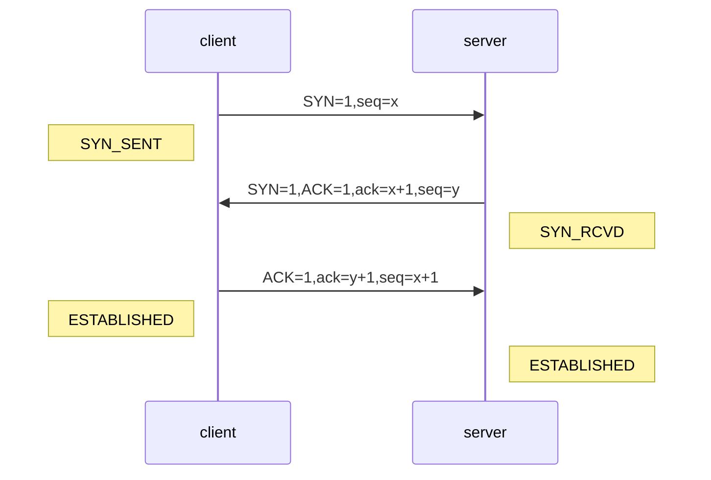
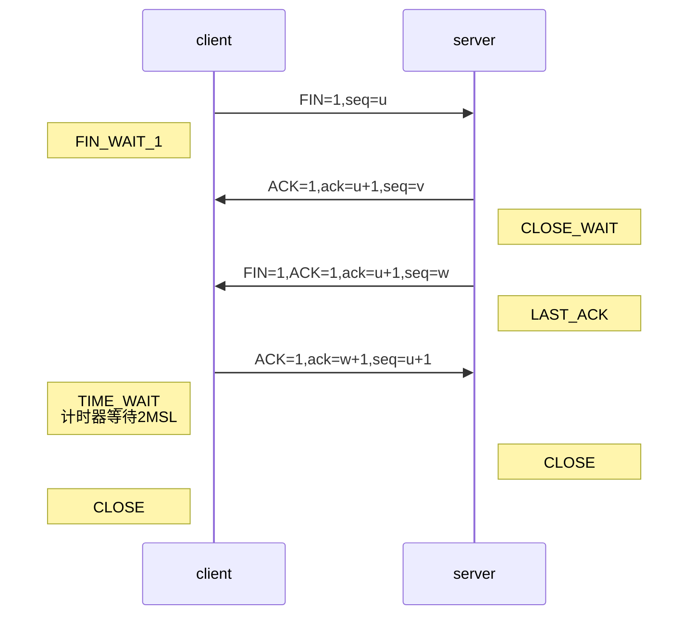

@[toc]
# TCP协议

​		**TCP**（传输控制协议，Transmission Control Protocol）是一种面向连接的、可靠的、基于字节流的传输层通信协议。	

​		TCP报文中的几个重要字段介绍如下

1. 序号：**seq**序号，占32位，用来标识从TCP源端向目的端发送的字节流序号，发送方发送数据时对此进行标记
2. 确认序号：**ack**序号，占32位，只有当**ACK**标志位为1时，确认序号才有效，ack=seq+1
3. 标志位：共有6个，即RRG、ACK、PSH、RST、SYN、FIN，含义如下
   - [ ] **URG**：紧急指针有效
   - [ ] **ACK**：确认序号有效
   - [ ] **PSH**：接收方应尽快将这个报文交给应用层
   - [ ] **RST**：重置连接
   - [ ] **SYN**：发起一个新连接
   - [ ] **FIN**：释放一个连接

## TCP的三次握手

​		三次握手就是建立TCP连接，需要客户端和服务端总共发送3个数据包以确认连接的建立。三次握手过程如下：

1. 第一次握手

   ​	client将标志位SYN置为1，产生一个序列值seq=x，将该数据包发送给server，client进入*SYN_SENT*状态，等待server确认

2. 第二次握手

   ​	server接收到client发送过来的数据包，由标志位SYN=1知道client是想与之建立新的连接，server将SYN标志和ACK标志位均置为1，ack=x+1，并产生一个序列值seq=y，将该数据包发送给client，server进入*SYN_RCVD*状态，等待client确认

3. 第三次握手

   ​	client接收到server发送过来的数据包，检查ACK是否为1、ack是否为x+1，如果正确则将标志位ACK置为1，ack=y+1,并将该数据包发送给server；server检查ACK是否为1、ack是否为y+1，如果正确则连接成功，client和server进入*ESTABLISHED*状态，完成三次握手。随后，client和server之间可以开始传输数据了

## TCP的四次挥手

​	四次挥手就是断开TCP连接，需要客户端和服务端总共发送4个数据包以确认连接的断开。四次挥手流程如下：

1. 第一次挥手

   ​	client发送一个FIN=1，seq=u的数据包，用来关闭client到server的数据传输，client进入*FIN_WAIT_1*状态

2. 第二次挥手

   - [ ] server接收到client发送的数据包，将ACK标志位置为1，ack=u+1，并产生一个序列值seq=v，将该数据包发送给client，server进入*CLOSE_WAIT*状态
   - [ ] client接收到server的确认后，进入*FIN_WAIT_2*状态，等待server发送连接释放报文
   - [ ] 这时TCP服务器通知高层的应用程序，客户端到服务端的连接释放了，此时TCP处于半连接的状态，客户端不再向服务端发送数据，但还能接收来自服务端的数据

3. 第三次挥手

   ​	server向client发送完最后的数据，就向client发送一个FIN=1，ACK=1，ack=u+1，seq=w的报文，server进入*LAST_ACK*状态，等待客户端确认

4. 第四次挥手

   - [ ] client接收到server的数据包，并对此发出确认报文ACK=1，ack=w+1，seq=w，client进入*TIME_WAIT*状态，等待时间等待计时器设置的时间2MSL后，client进入*CLOSE*状态
   - [ ] server接收到client的报文后进入*CLOSE*状态

## 流量控制

- [ ] 流量控制是为了防止发送方发送的太快，接收方来不及接收
- [ ] 流量控制发生在发送端和接收端之间，只是点对点的控制
- [ ] 流量控制的丢包位置是在接收方，控制的对象也是接收方
- [ ] 流量控制的原理是使用滑动窗口，来告诉发送端接收端的缓冲区大小，如果接收端缓冲区满了，会将滑动窗口设置为0，发送端就不会再将数据发送给接收端，这时需要以一定的频率发送一个窗口探测数据段，让接收端将自己的滑动窗口告诉自己，直到滑动窗口大于0

## 拥塞控制

​	拥塞控制是为了防止发送方发送的太快，网络来不及处理从而导致网络拥堵。拥塞控制通常是一个全局性的过程，涉及所有的主机、路由器以及降低网络传输性能的所有因素。拥塞控制的丢包位置是在路由器，控制的对象是网络。

​	拥塞控制的方式有以下几种，cwnd表示拥塞窗口，ssthresh表示慢开始门限

- 慢开始

  ​	一开始发送小数据量的数据探测网络（cwnd=1），每收到一个ACK则将cwnd扩大一倍，直到cwnd到达ssthewsh为止。

- 拥塞避免

  ​	当cwnd>ssthresh时，采用拥塞避免算法，使cwnd线性增大；当出现网络拥塞时，将ssthresh减为原来的一半，并将cwnd重置为1，执行慢开始算法。

- 快重传

  ​	快重传要求发送方连续接收到三个重复确认就应当立即重传对方尚未接收到的报文，而不必等待重传计时器时间的到来。这样可以尽早重传未被确认的报文，能提高整个网络的吞吐量。

- 快恢复

  ​	采用快恢复算法时，慢开始只是在TCP连接建立和网络出现超时时使用；当发送方连续接收到三个重复确认时将ssthresh减半，cwnd置为ssthresh而不是1，然后执行拥塞避免算法。	

##  SYN攻击

​	在三次握手中，server在发送SYN-ACK报文后处于SYN_RCVD状态，收到client确认之前TCP连接称为半连接。SYN攻击就是client在短时间内伪造大量不存在的IP地址，并不断向server发送SYN包，server回复确认包并等待client的确认，由于这些IP是不存在的，server需要不断重发直至超时。这些伪造的SYN包占用未连接队列，导致正常的请求因队列满而被丢弃，从而导致网络堵塞甚至瘫痪。

​	SYN攻击是一种典型的DOS攻击，当检测到server存在大量的半连接状态且源IP是随机的，则可以推断遭到了SYN攻击。使用下面的命令可以让之现形：

​	` netstat -nap | grep SYN_RCVD` 

## 面试题

1. 为什么是三次握手

   ​	为了实现可靠传输，发送方和接收方始终需要同步，双方才能直到对方已经做好了准备。假如只有两次握手，在网络中滞留的连接请求也到达了服务端时，服务端向客户端发出确认即建立连接，那么这时的连接可能已经是失效的了，这样会创建很多不必要的连接，浪费资源。

2. 为什么是四次挥手

   ​	因为TCP是双通道的，一方与另一方断开连接需要两次握手。

3. 为什么在四次挥手时client在等待2MSL时间后才由*TIME_WAIT*状态转为*CLOSE*

   ​	MSL（Maximum Segment Lifetime），报文最大生存时间，是任何报文在网络中存活的最大时间，超过这个时间报文会被丢弃。client发送最后的ACK回复，但该ACK可能丢失，如果server没有收到ACK回复则会重发FIN，所以client不能直接关闭，它必须确认server接受到了ACK。client在发送ACK之后进入*TIME_WAIT*状态同时设置一个计时器，等待2MSL时间。若在计时器到期时间内收到了FIN，则重发ACK并重置计时器。2MSL就是一个发送报文和一个回复报文的最大存活时间，超过这个时间则认为server已经成功接收到了ACK，则可以释放TCP连接。而且，经过2MSL时间，本次TCP连接时间内产生的所有报文都已经消失了，在下一次连接中就不会出现旧的请求连接报文段。
