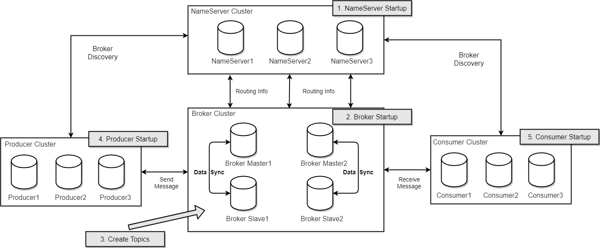

[TOC]

# RocketMQ架构分析

RocketMQ天生就是一个分布式的架构，下面是RocketMQ的架构图（来自RocketMQ官网）:

从图中可以看到，RocketMQ主要由以下四大部分组成：NameServer、Broker、Producer、Consumer，每个部分都是分布式的，都可以很方便的进行横向扩展以及分布式部署。接下来分别介绍每个组成部分的作用。

## NameServer

简单理解，NameServer就是RocketMQ的注册中心，它是一个轻量级的、分布式的、无状态的路由发现组件。各个NameServer之间是独立的、互不通信的，这就要求每个NameServer上必须要有完整的路由信息。NameServer的作用主要有以下两个：

### 1. Broker管理

每个Broker在启动时会向所有的NameServer注册Broker的信息（包括ip+端口等），同时NameServer启动时会开启一个定时任务，定时检测Broker的心跳，以此来检查Broker是否还存活。Broker维护了逻辑上的Topic和队列信息。

### 2. 路由管理

每一个NameServer上都保存了完整的路由信息，Producer和Consumer可以通过NameServer获取到关于Broker集群的整个路由信息，根据路由信息，客户端可以完成消息的发送和消费以及消息的查询。

## Broker

Broker其实是RocketMQ真正意义上的服务器，负责消息的存储、投递、查询以及保障高可用等功能。每个Broker会和集群中的所有NameServer建立长连接，定时上报Topic的路由信息到所有的NameServer。

Broker按照角色可以分为Master和Slave，Master和Slave的关系是1:n。Master和Slave的对应关系是通过相同的BrokerName来对应的，一组Master和Slave的BrokerName相同，角色是通过BrokerId进行区分的，BrokerId为0表示Master，非0表示Slave。

## Producer

Producer是生产者，即生成消息的来源，它是完全无状态的。Producer会随机从NameServer集群中挑选一个节点并与之建立长连接，定期从NameServer获取Topic的路由信息。在发送消息时，根据路由信息，轮询Broker上的队列进行负载均衡。

## Consumer

Consumer是消费者，即消息的接收方。RocketMQ支持Pull和Push两种模式的消费，也支持集群方式和广播方式的消费。Consumer也会随机从NameServer集群中挑选一个节点并与之建立长连接，定期从NameServer获取Topic的路由信息。值得一提的是，默认情况下，Consumer只会与Broker上的Master节点建立连接通道以拉取消息，但是当Master节点压力比较大（Consumer的消费进度延迟大）且开启了从服务器可读时，Master会向Consumer返回下一次从Slave节点拉取消息的响应，Consumer下一次就会转向Slave拉取消息。

## 工作流程

从最上边的架构图可以看出，RocketMQ的工作流程如下：

1. NameServer集群启动
2. Broker集群启动，向NameServer注册Broker的Ip+Port信息，并定期上报Topic的路由信息
3. 创建Topic，并向NameServer上报路由信息
4. Producer启动，与任意一个NameServer节点建立长连接，获取到路由信息；发送消息时，根据负载均衡策略选择一个Broker发送请求
5. Consumer启动，与任意一个NameServer节点建立长连接，获取到当前订阅的Topic在哪些Broker上，之后与Broker建立连接通道，拉取消息处理